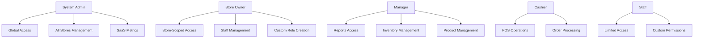

# POS Xpress Backend - Project Specification

## Overview

POS Xpress adalah sistem backend komprehensif yang menyediakan REST API untuk aplikasi Point of Sale mobile dengan kemampuan offline-first dan admin panel berbasis Filament v4. Sistem ini mendukung multi-tier subscription, multi-outlet management, inventory tracking dengan COGS calculation, dan comprehensive reporting system.

## Arsitektur Sistem

### Technology Stack

| Komponen            | Teknologi                 | Versi  | Tujuan                        |
| ------------------- | ------------------------- | ------ | ----------------------------- |
| **Runtime**         | PHP                       | 8.4+   | Application runtime           |
| **Framework**       | Laravel                   | 12.x   | Web application framework     |
| **Authentication**  | Laravel Sanctum           | Latest | API token management          |
| **Authorization**   | Spatie Laravel Permission | Latest | Role-based access control     |
| **Admin Panel**     | FilamentPHP               | v4     | Administrative interface      |
| **Database**        | MySQL                     | Latest | Primary data storage          |
| **Cache/Queue**     | Redis                     | Latest | Caching and job queues        |
| **Web Server**      | Nginx                     | Latest | HTTP server and reverse proxy |
| **Process Manager** | Supervisor                | Latest | Queue worker management       |

### Arsitektur Multi-Tenant

Sistem menggunakan **store-based multi-tenancy** dengan data isolation yang ketat:

-   **Global Scopes**: Semua model memiliki `store_id` dan secara otomatis di-filter berdasarkan store user yang sedang login
-   **System Admin Bypass**: Role `admin_sistem` dapat mengakses semua data tanpa batasan store
-   **Tenant Middleware**: Memvalidasi akses cross-store dan mencegah data leakage
-   **Store Context**: User dapat memiliki konteks store yang berbeda untuk akses multi-outlet

## Sistem Role dan Permission

### Hierarki Role



### Role dan Permission Matrix

#### 1. **admin_sistem** (System Administrator)

-   **Scope**: Global (bypasses tenant scoping)
-   **Access Level**: System-wide
-   **Key Permissions**:
    -   `*` (semua permissions)
    -   `subscription.manage`
    -   `system.backup`, `system.maintenance`, `system.logs`
    -   Akses ke semua stores dan data global

#### 2. **owner** (Store Owner)

-   **Scope**: Store-scoped
-   **Access Level**: Full store access
-   **Key Permissions**:
    -   `users.manage`, `users.manage_roles`
    -   `products.*`, `orders.*`, `payments.*`, `refunds.*`
    -   `tables.*`, `members.*`, `inventory.*`
    -   `reports.*`, `cash_sessions.*`, `expenses.*`
    -   `subscription.view`
    -   Dapat membuat dan mengatur role custom untuk staff

#### 3. **manager** (Store Manager)

-   **Scope**: Store-scoped
-   **Access Level**: Operational management
-   **Key Permissions**:
    -   `products.view`, `products.create`, `products.update`, `products.manage_categories`
    -   `orders.view`, `orders.create`, `orders.update`, `orders.refund`
    -   `payments.view`, `payments.create`, `payments.update`
    -   `refunds.view`, `refunds.create`, `refunds.update`
    -   `tables.view`, `tables.update`
    -   `members.view`, `members.create`, `members.update`
    -   `inventory.view`, `inventory.adjust`, `inventory.reports`
    -   `reports.view`, `reports.export`
    -   `cash_sessions.open`, `cash_sessions.close`, `cash_sessions.view`
    -   `expenses.view`, `expenses.create`, `expenses.update`

#### 4. **cashier** (Cashier)

-   **Scope**: Store-scoped
-   **Access Level**: POS operations only
-   **Key Permissions**:
    -   `products.view`
    -   `orders.view`, `orders.create`, `orders.update`
    -   `payments.view`, `payments.create`
    -   `tables.view`, `tables.update`
    -   `members.view`
    -   `cash_sessions.open`, `cash_sessions.close`, `cash_sessions.view`

### Permission Categories

```php
$permissions = [
    'users' => ['view', 'create', 'update', 'delete', 'manage_roles'],
    'products' => ['view', 'create', 'update', 'delete', 'manage_categories'],
    'orders' => ['view', 'create', 'update', 'delete', 'refund', 'void'],
    'payments' => ['view', 'create', 'update', 'delete'],
    'refunds' => ['view', 'create', 'update', 'delete'],
    'tables' => ['view', 'create', 'update', 'delete'],
    'members' => ['view', 'create', 'update', 'delete'],
    'inventory' => ['view', 'adjust', 'transfer', 'reports'],
    'reports' => ['view', 'export', 'email'],
    'cash_sessions' => ['open', 'close', 'view', 'manage'],
    'expenses' => ['view', 'create', 'update', 'delete'],
    'subscription' => ['view', 'manage'], // admin_sistem only
    'system' => ['backup', 'maintenance', 'logs'], // admin_sistem only
];
```

## Sistem Subscription dan Plan Gating

### Subscription Plans

#### 1. **Basic Plan** - Rp 99.000/bulan (Rp 990.000/tahun)

-   **Features**:
    -   POS operations
    -   Basic reports
    -   Customer management
    -   Member management
-   **Limits**:
    -   Products: 20
    -   Users: 2
    -   Outlets: 1
    -   Annual Transactions: 12,000 (soft cap)

#### 2. **Pro Plan** - Rp 199.000/bulan (Rp 1.990.000/tahun)

-   **Features**:
    -   All Basic features
    -   Advanced reports
    -   Inventory tracking
    -   COGS calculation
    -   Monthly email reports
    -   Report export
-   **Limits**:
    -   Products: 300
    -   Users: 10
    -   Outlets: 1
    -   Annual Transactions: 120,000 (soft cap)

#### 3. **Enterprise Plan** - Rp 399.000/bulan (Rp 3.990.000/tahun)

-   **Features**:
    -   All Pro features
    -   Advanced analytics
    -   Multi-outlet management
    -   API access
    -   Priority support
-   **Limits**:
    -   Products: Unlimited
    -   Users: Unlimited
    -   Outlets: Unlimited
    -   Annual Transactions: Unlimited

### Plan Gating Logic

#### Soft Cap Implementation

-   **Transaction Limits**: Ketika quota tahunan terlampaui, sistem tetap memproses transaksi tetapi:
    -   Menambahkan warning headers
    -   Membatasi akses ke fitur premium (report export, advanced analytics)
    -   Mengirim notifikasi untuk upgrade plan
    -   Tidak menghentikan operasi POS core

#### Feature Access Control

```php
// Feature requirements mapping
$featureRequirements = [
    'inventory_tracking' => 'Pro',
    'cogs_calculation' => 'Pro',
    'multi_outlet' => 'Enterprise',
    'advanced_reports' => 'Pro',
    'report_export' => 'Pro',
    'monthly_email_reports' => 'Pro',
];
```

#### Hard Limits

-   **Products**: Hard limit yang menghentikan penambahan produk baru
-   **Users**: Hard limit yang mencegah penambahan user baru
-   **Outlets**: Hard limit kecuali Enterprise plan

## Filament Admin Panel

### Dual Panel Configuration

#### 1. **Admin Panel** (`/admin`)

-   **Target Role**: `admin_sistem`
-   **Access**: Global, semua stores
-   **Resources**:
    -   StoreResource (manajemen semua stores)
    -   UserResource (manajemen semua users)
    -   SubscriptionResource (manajemen subscriptions)
    -   SystemMetricsResource (SaaS metrics)
-   **Middleware**: `FilamentRoleMiddleware:admin_sistem`

#### 2. **Owner Panel** (`/owner`)

-   **Target Role**: `owner`
-   **Access**: Store-scoped
-   **Resources**:
    -   ProductResource
    -   OrderResource
    -   CategoryResource
    -   InventoryResource
    -   ReportResource
-   **Middleware**: `FilamentRoleMiddleware:owner`

### Test Credentials

-   **Admin Panel**: `admin@xpresspos.com` / `password123`
-   **Owner Panel**: `owner@xpresspos.com` / `password123`

## API Architecture

### Authentication Flow

-   **Bearer Token**: Laravel Sanctum untuk API authentication
-   **Session Auth**: Filament panels menggunakan session authentication
-   **Multi-Guard**: Support untuk web dan API guards

### API Versioning

-   **Current Version**: `/api/v1`
-   **Future Versions**: `/api/v2`, `/api/v3`
-   **Deprecation Policy**: 6-month notice period

### Response Format

```json
{
    "success": true,
    "data": {},
    "message": "Operation completed successfully",
    "meta": {
        "timestamp": "2024-01-01T00:00:00Z",
        "version": "v1",
        "request_id": "uuid"
    }
}
```

### Error Response Format

```json
{
    "success": false,
    "error": {
        "code": "VALIDATION_ERROR",
        "message": "The given data was invalid.",
        "details": {
            "email": ["The email field is required."]
        }
    },
    "meta": {
        "timestamp": "2024-01-01T00:00:00Z",
        "request_id": "uuid"
    }
}
```

## Data Models dan Relationships

### Core Business Entities

#### Multi-Tenancy Models

-   **Store**: Root entity untuk multi-tenancy
-   **User**: Terikat ke store dengan role-based access
-   **Subscription**: Store subscription dengan plan dan usage tracking

#### Product Catalog

-   **Category**: Product categorization
-   **Product**: Core product dengan variants dan options
-   **ProductOption**: Product variants (size, color, etc.)
-   **Recipe**: BOM untuk COGS calculation

#### Point of Sale

-   **Order**: Transaction records
-   **OrderItem**: Individual items dalam order
-   **OrderItemOption**: Selected options untuk items
-   **Payment**: Payment records dengan multiple methods
-   **Refund**: Refund transactions

#### Inventory Management (Pro/Enterprise)

-   **InventoryMovement**: Stock movement tracking
-   **StockLevel**: Current stock levels
-   **CogsHistory**: Cost tracking untuk profit calculation

#### Customer Management

-   **Member**: Customer loyalty program
-   **MemberTier**: Loyalty tiers dengan benefits
-   **Table**: Restaurant table management

#### Financial Management

-   **CashSession**: Daily cash register sessions
-   **Expense**: Business expense tracking
-   **OrderTax**: Tax calculations
-   **OrderDiscount**: Discount applications

### Key Relationships

```php
// Multi-tenancy
Store ||--o{ User : employs
Store ||--o{ Subscription : subscribes
Plan ||--o{ Subscription : defines

// Product Catalog
Store ||--o{ Category : organizes
Category ||--o{ Product : contains
Product ||--o{ ProductOption : has

// Point of Sale
User ||--o{ Order : creates
Order ||--o{ OrderItem : contains
Order ||--o{ Payment : settled_by

// RBAC (Spatie Permission)
User ||--o{ ModelHasRole : has
Role ||--o{ ModelHasRole : assigned_to
Role ||--o{ RoleHasPermission : grants
```

## Security Implementation

### Authentication Layers

1. **Sanctum Token Validation**: API bearer token authentication
2. **Multi-Tenancy**: Store-scoped data access
3. **RBAC**: Spatie permission checking dengan multi-level admin access
4. **Plan Gating**: Subscription feature/limit validation
5. **Rate Limiting**: Request throttling per user/IP

### Data Protection

-   **Encryption**: Sensitive data encrypted at rest (Laravel encryption)
-   **HTTPS**: Enforced untuk semua API communications
-   **SQL Injection Prevention**: Via Eloquent ORM
-   **XSS Protection**: Input sanitization
-   **CSRF Protection**: Web routes protection

### Access Control Enforcement

```php
// Global scope untuk automatic store filtering
class StoreScope implements Scope
{
    public function apply(Builder $builder, Model $model)
    {
        $user = auth()->user();

        // System admin bypasses tenant scoping
        if ($user && $user->hasRole('admin_sistem')) {
            return;
        }

        // Apply store scoping for all other users
        if ($user && $user->store_id) {
            $builder->where('store_id', $user->store_id);
        }
    }
}
```

## Testing Strategy

### Current Test Status

-   **API Tests**: 70/70 passed (100% success)
-   **Feature Tests**: 162 passed, 109 failed
-   **Unit Tests**: 28 passed, 23 failed
-   **Total**: 260 passed, 132 failed

### Test Coverage Requirements

-   **Unit Tests**: 90%+ untuk business logic
-   **Feature Tests**: 80%+ untuk API endpoints
-   **Integration Tests**: 70%+ untuk external services
-   **E2E Tests**: Key flows untuk complete user journeys

## Migration Status

### ✅ Completed

1. **Project Setup**: Laravel 12 dengan dependencies
2. **Database Schema**: Migration lengkap dengan semua tabel
3. **Models & Services**: Business logic migration
4. **API Controllers**: Semua API endpoints aktif
5. **Authentication**: Sanctum + Spatie Permission
6. **Filament Panels**: Dual panel setup dengan role-based access
7. **Testing**: 260 tests passed, API stabil

### ⏳ In Progress

1. **Minor Test Fixes**: 132 failed tests (kebanyakan setup issues)
2. **Resource Configuration**: Form fields, table columns, actions
3. **Advanced Services**: Reporting, Sync, Payment integration
4. **Background Jobs**: Queue processing dan notifications

### 🔄 Next Steps

1. **Complete Filament Resources**: Form validation, table columns, actions
2. **Add More Resources**: Categories, Inventory, Reports
3. **Custom Widgets**: Dashboard widgets per panel
4. **Navigation & Branding**: Custom themes dan navigation
5. **Payment Integration**: Subscription payment flow
6. **Advanced Reporting**: Monthly reports dengan PDF export

## Development Guidelines

### Code Standards

-   **PSR-12**: Coding standards compliance
-   **Laravel Pint**: Code formatting
-   **80%+ Test Coverage**: Minimum test coverage requirement

### API Standards

-   **RESTful Design**: Consistent API design
-   **JSON Response Format**: Standardized response structure
-   **HTTP Status Codes**: Proper status code usage
-   **Bearer Token Authentication**: Sanctum implementation

### Database Standards

-   **Migrations**: Schema changes via migrations
-   **Proper Indexing**: Query optimization
-   **Naming Conventions**: Consistent naming patterns
-   **Multi-tenancy**: Store-scoped data isolation

## Deployment Architecture

### Environment Configuration

-   **Local**: Development dengan hot reload dan debug tools
-   **Staging**: Production-like environment untuk integration testing
-   **Production**: Live environment dengan monitoring dan alerting

### Docker Setup

```yaml
services:
    app: php:8.4-fpm
    nginx: nginx:alpine
    mysql: mysql:8.0
    redis: redis:7-alpine
    supervisor: queue workers
```

### Monitoring & Observability

-   **Health Check**: `/api/v1/health` endpoint
-   **Error Tracking**: Sentry integration
-   **Performance Monitoring**: Telescope untuk development
-   **Logging**: Structured JSON logging dengan correlation IDs

## Kesimpulan

POS Xpress Backend adalah sistem yang kompleks dengan arsitektur multi-tenant yang solid. Sistem sudah memiliki:

1. **Role-based Access Control** yang komprehensif dengan 4 level role
2. **Subscription Plans** dengan feature gating dan soft cap logic
3. **Filament v4 Dual Panel** untuk admin dan owner management
4. **API Architecture** yang stabil dengan 100% API test success
5. **Multi-tenancy** dengan data isolation yang ketat
6. **Security Implementation** yang robust dengan multiple layers

Sistem siap untuk development lanjutan dengan fokus pada:

-   Menyelesaikan Filament resource configuration
-   Menambahkan payment integration
-   Mengembangkan advanced reporting features
-   Menyelesaikan background job processing

**Status**: ✅ **Siap untuk production development** dengan foundation yang solid dan testing yang komprehensif.
